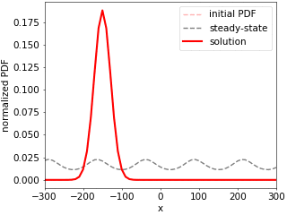
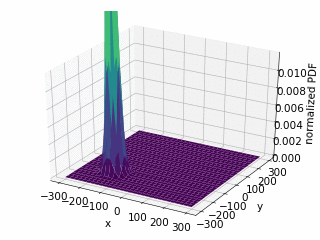

[](https://pypi.org/project/fplanck/)

# FPlanck
FPlanck is a Python library for numerically solving the Fokker-Planck partial differential equation (also known as the Smoluchowski equation) in N dimensions using a matrix numerical method:

<p align="center">
  
</p>

The method is based on the paper *"Physically consistent numerical solver for time-dependent Fokker-Planck equations"* by V. Holubec, K. Kroy, and S. Steffenoni, available on [arXiv](https://arxiv.org/pdf/1804.01285.pdf) and published in [APS](https://journals.aps.org/pre/abstract/10.1103/PhysRevE.99.032117).

## Features
+ Declare external potentials (conservative) and force fields (non-conservative) in N-dimensions
+ Solve for the steady-state probability distribution and probability currents
+ Propagate any initial probability distribution to the solution at any later time
+ Periodic and reflecting boundary conditions (can be mixed along different dimensions)

## Installation and Usage
```shell
pip install fplanck
```

See the [examples](src/fplanck/examples) folder for how to use FPlanck.

Run any of the available [examples](src/fplanck/examples) without explicit installation using `uv`:

| Command | Description |
|---------|-------------|
| `uvx fplanck free_space` | Free diffusion in 1D with periodic boundary conditions |
| `uvx fplanck harmonic` | 1D harmonic potential with time evolution |
| `uvx fplanck harmonic_2d` | 2D harmonic potential showing restoration to equilibrium |
| `uvx fplanck periodic` | Particle in a periodic cosine potential with reflecting boundaries |
| `uvx fplanck ratchet` | Tilted periodic potential (Brownian ratchet) with periodic boundaries |
| `uvx fplanck ring` | 2D particle driven by non-conservative force field in a ring pattern |
| `uvx fplanck nonuniform_diffusion` | Position-dependent drag coefficient |
| `uvx fplanck tilted_bigaussian` | Double-well potential with linear tilt |


## Demos

<p align="center">
  
  <br>
  <em>A single particle in a titled periodic potential with periodic boundary conditions. The animation shows the time evolution of the probability distribution for the particle location. The PDF is driven in the positive direction due to the tilted potential. </em>
</p>


<p align="center">
  
  <br>
  <em>A single particle in a 2D harmonic potential. The particle is initially away from the center of the harmonic well, and over time is restored to the center.</em>
</p>


## License
FPlanck is licensed under the terms of the MIT license.


---

#### References
[1] Wikipedia contributors, "Fokker–Planck equation," Wikipedia, The Free Encyclopedia, https://en.wikipedia.org/w/index.php?title=Fokker%E2%80%93Planck_equation&oldid=906834519

[2] Holubec, V., Kroy, K. and Steffenoni, S., 2019. Physically consistent numerical solver for time-dependent Fokker-Planck equations. Physical Review E, 99(3), p.032117.
